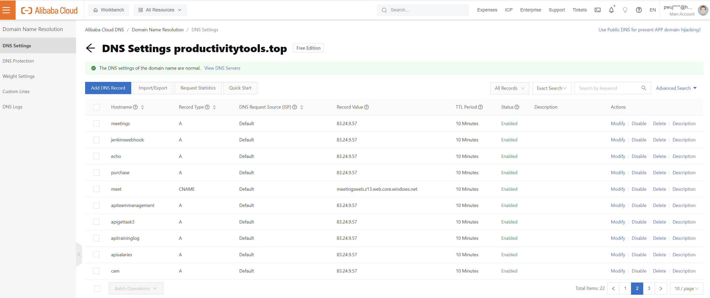

<!--Category:C#--> 
 <p align="right">
    <a href="http://productivitytools.top/alibabacloud-ipmonitor/"><a> 
    <a href="https://github.com/pwujczyk/ProductivityTools.AlibabaCloud.IpMonitor"></a>
</p>
<p align="center">
    <a href="http://http://productivitytools.tech/">
        
    </a>
</p>


# AlibabaCloud.IpMonitor

Windows service which keep Alibaba DNS in sync with public address of the server.

<!--more-->

I do not have public IP, but I have server where I host applications. This application is installed as a service. Every x seconds it checks what is the assigned public IP to my router and updates value on Alibaba DNS servers. 


In the config we have values
- GmailPassword - Application sends email when value it will update value or in case of error
- Hosts - those hosts will be updated in the Alibaba
```
{
  "Region": "cn-hangzhou",
  "AccessKeyId":"",
  "AccessKeySecret":"",
  "GmailPassword":"", 
  "Hosts":["purchase","echo","jenkinswebhook","meetings","identityserver","apiteammanagement","apigettask3"]
}
```

