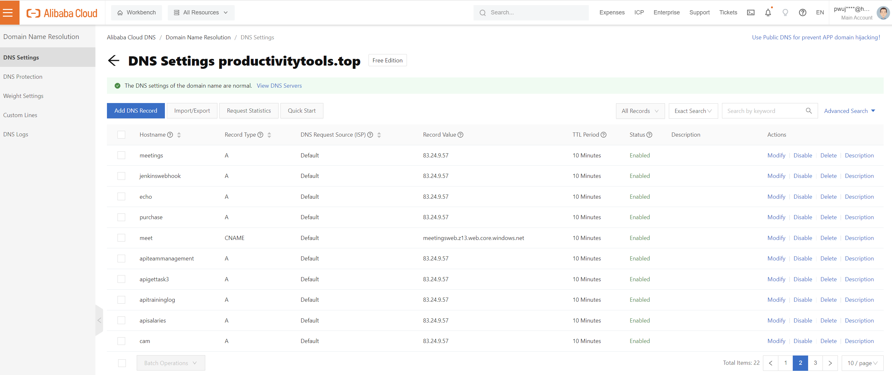
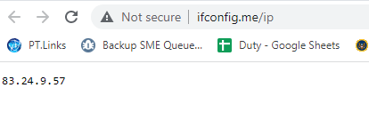

<!--Category:C#--> 
 <p align="right">
    <a href="http://productivitytools.top/alibabacloud-ipmonitor/"><a> 
    <a href="https://github.com/pwujczyk/ProductivityTools.AlibabaCloud.IpMonitor"></a>
</p>
<p align="center">
    <a href="http://http://productivitytools.tech/">
        
    </a>
</p>


# AlibabaCloud.IpMonitor

Windows service which keep Alibaba DNS in sync with public address of the server.

<!--more-->

I do not have public IP, but I have server where I host applications. This application is installed as a service. Every x seconds it checks what is the assigned public IP to my router and updates value on Alibaba DNS servers. 


### Configuration
The application uses two sources for configuration: the local `appsettings.json` and the **Master Configuration** (external NuGet package managed settings).

#### Local Configuration (`appsettings.json`)
Typically used for host-specific synchronization settings:
```json
{
  "Region": "cn-hangzhou",
  "AccessKeyId": "YOUR_ACCESS_KEY_ID",
  "AccessKeySecret": "YOUR_ACCESS_KEY_SECRET",
  "Hosts": [
    {
      "RR": "jenkins",
      "Type": "A",
      "MapToExternal": true
    },
    {
      "RR": "echo",
      "Type": "CNAME",
      "Target": "another.domain.com",
      "MapToExternal": false
    }
  ]
}
```

#### Master Configuration
Sensitve or shared settings like the **GmailPassword** are retrieved from the Master Configuration:
- **GmailPassword**: Used to send email notifications when IPs are updated or errors occur.

### Host Configuration properties:
- **RR**: The host record (subdomain), e.g., "www" or "jenkins".
- **Type**: The DNS record type, e.g., "A", "CNAME", "AAAA".
- **Target**: The target value for the record (used if `MapToExternal` is false).
- **MapToExternal**: 
  - `true`: The record value will be automatically set to the current public (external) IP of the machine.
  - `false`: The record value will be set to the value provided in the `Target` property.




To get external IP service is using http://ifconfig.me/ip webpage.



Application is also using Master configuration nuget package. 